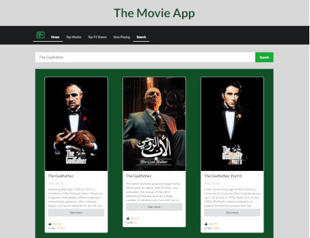
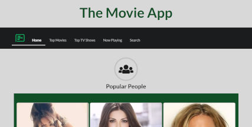
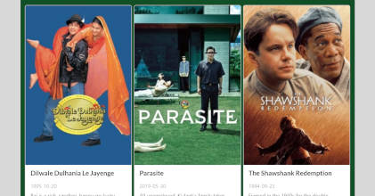
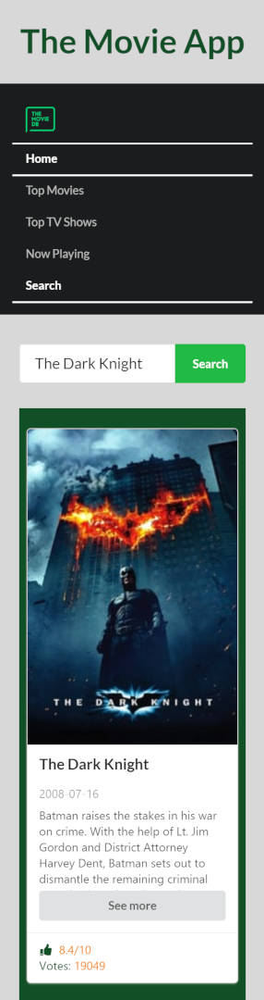
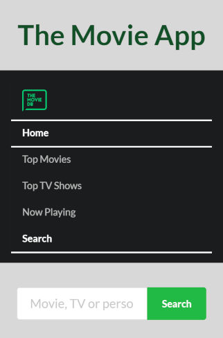

This project was bootstrapped with [Create React App](https://github.com/facebook/create-react-app).

# The Movie App
> Hi everyone! This is my The Movie App. 

## Live
https://the-movie-app-react.herokuapp.com/

## Technologies:
* React
* Java Script
* HTML5
* CSS 3
* Semantic UI
* Redux
* Axios library
* Redux-thunk
* React-router-dom

## General info
This is my The Movie App. I've created it to develope my React and Redux skills. 
In this project I used react-router-dom so you can navigate between components. 
In this app you can see popular people, top rated movies, top rated TV shows or now playing movies. In Search component you can search movies, TV shows, people by title, name, etc.
I used themoviedb API. 
https://www.themoviedb.org/ 

## Screenshots

![screenshot - 4](./readme-img/tablet-full.jpg

## Contact
Created by [lubiankamateusz@gmail.com] - feel free to contact me!